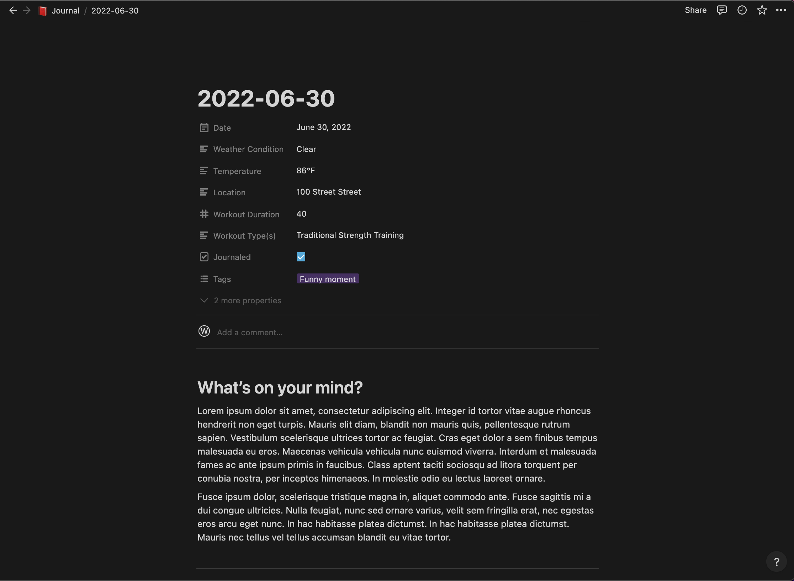

# Notion Journal Bot



# What is this and what does this do?

This is a collection of microservices that connect with Notion's API to make daily journaling easier. I found myself writing out bits of information about each day such as what the weather was like or what I did that day. This was a waste of the limited time I spend journaling, so I've automated a lot of it with a few goals in mind:

- Automatically include enough context about each day such as weather, calendar events, etc. to trigger memories
- Allow you to focus on writing about your thoughts instead of recounting bits of information that can be collected automatically
- Provide different journal prompts depending on the day or any other condition that you can express with code.

# Install

Due to current limitations with Notion integrations, setting up this journal bot requires some coding knowledge.

1. Create a Calendar DB in Notion (As long as the DB has a property Date, it will work!)
2. Deploy `write-to-entry` in Google Cloud Functions. If you want to send data via iOS shortcuts, you will need to set the permissions to allow unauthenticated calls.
3. Update the `NOTION_API_KEY` and `NOTION_DATABASE_ID` runtime environment
4. Set up other services to post data to `write-to-entry`

# Architecture Diagram


# How it works

The primary service in this journal bot is `write-to-entry`. This cloud function receives data via http request and writes it to your specified Notion DB. You can specify whether you want to write the data to a property or as content. Once you have `write-to-entry` deployed, you can add data from any source, as long as you can make a post request. For example, I'm using iOS shortcuts to post fitness and location data, and then I'm using another cloud function to post news data from newsapi.org.

## Writing data

Anytime data is posted to the DB, `write-to-entry` will automatically create a new entry with the title of the date in ISO8601 format if there isn't already one.

The body of your http requests will be different depending on whether you want to write some content (page body) or update a page property.

#### Content

```
{
    contentOrProperty: 'content',
    type: 'paragraph',
    title: 'Daily Prompts',
    body: ['What did you do today?', 'Did you accomplish your goals today?', 'What was your favorite part of the day?'],
    divider: true,
}
```

For `type`, you can use any text based block that the Notion API allows for ([Refer to Block object](https://developers.notion.com/reference/block)). Some examples include:

- paragraph
- heading_3
- bulleted_list_item

Then in `body`, which is an array, you can pass in a combination of strings or the following objects.

```
   [
     "Some line of plain text",
     {
       content: "A link to something",
       link: {
         type: "url",
         url: "https://twitter.com/NotionAPI",
       },
     },
     "Another line of plain text",
   ]
```

#### Property

```
{
    contentOrProperty: 'property',
    property: 'Weather',
    type: 'text',
    value: '86°F'
}
```

`type` only supports "text" or "number".

## Sending data from iOS Shortcuts

I found that the easiest way to get data such as location, weather, calendar, and fitness data was to use iOS shortcuts. All of that data is already connected to my phone, so it's much easier to use shortcuts rather than some other API.

Use the [Get Contents of URL shortcut](https://support.apple.com/guide/shortcuts/request-your-first-api-apd58d46713f/ios) to make a post request from your phone, and then you can use Automations to recurring requests.

## Sending data from an API

I wanted to record news headlines from that day to remind me what was going on in the world at the time. You can see how I did this in `/append-news`.

It's a cloud function that fetches the headlines from a news API and then makes a POST request with that data to `write-to-entry`. I use Cloud Scheduler to set up recurring requests.

## Customizing Journal Prompts

One cool thing we can do is write some logic that gives different journal prompts depending on the circumstances. For example, I give myself different journal prompts on the first day of the month vs other days. You can see how this is handled in `/append-prompts`.
